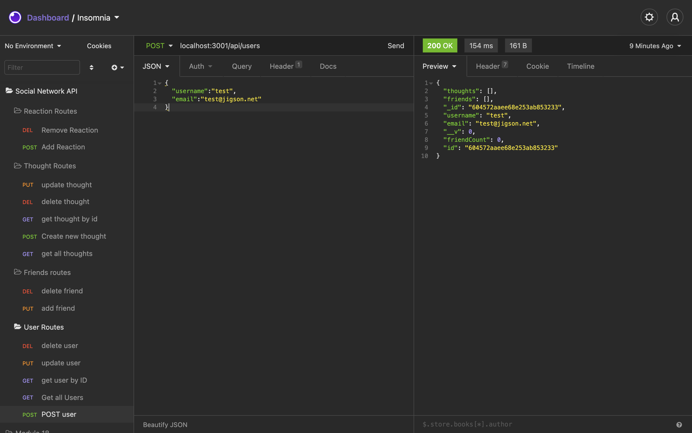

# Social Network API

## Description

This is a functional API for a simple social media website. It allows users to be added to a database, and then allows you to add friends or thoughts to those users' records in the database.

## Table of Contents

- [Installation](#installation) 
- [Usage](#usage) 
- [Questions](#questions)

## Installation

First, clone the code. Then, at the root folder, run npm i to install the necessary dependencies. After that, you can use Insomnia or a similar program to ensure the routes work, and then you can implement them into a front end social media project.

## Usage

Watch the attached video:

## Questions

If you have any questions, contact me at <maxhealy01@gmail.com>.

You can also check out my github profile at [Github](https://github.com/maxhealy01)
